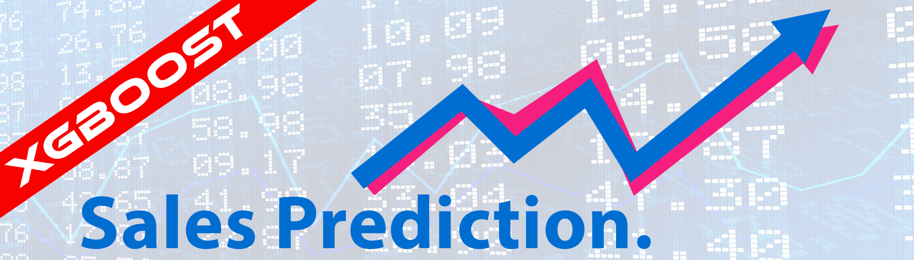
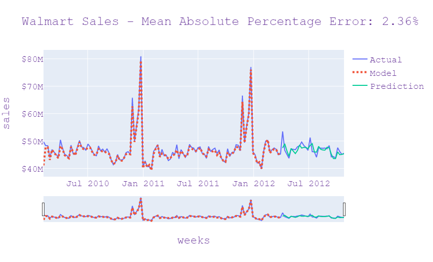

# Walmart Sales Prediction

In this repo, you will find my XGBoost model and a documentation of the feature extraction I used for sales forecasting. I used the [Walmart Sales Prediction Kaggle Dataset](https://www.kaggle.com/datasets/divyajeetthakur/walmart-sales-prediction), which contains sales data for different stores and departments from 05-Feb-2010 to 26-Oct-2012.

My model achieved a mean absolute percentage error of 2.36% over 7 months of hold out data.

The XGBoost model is then compared against forecasts using Holt Winter's method.

Read the full Jupyter Notebook at [https://kevinchtsang.github.io/walmart-sales/](https://kevinchtsang.github.io/walmart-sales/)